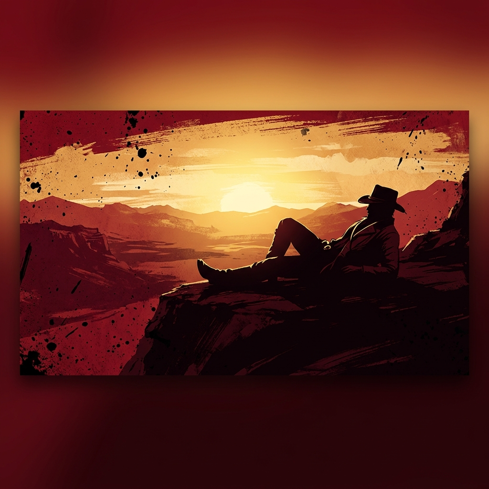

# YOU'RE A DEADMAN, I'M SENDING YOU STRAIGHT TO HELL

  

  <b>"We're thieves in a world that don't want us no more."</b> — Arthur Morgan

  
  
  
  

---

### WANTED: BUGS & ERRORS (Dead or Alive)
> *"We can't change what's done, we can only move on."* — Arthur Morgan

I am a **Computer Science Engineering student at IPB University** (Institut Pertanian Bogor). I track computational issues, build robust mobile architectures, and design intuitive, high-fidelity user experiences.

* **Code Camp:** Developing structured cross-platform mobile environments using **Flutter & Dart**.
* **Dead Eye Accuracy:** Converting Figma layouts into modular, pixel-perfect UI widgets.
* **The Next Trail:** Refining scalable web platforms and local database cache structures.

---

### THE ARSENAL (Tech Stack)
> *"I have a plan. You just need to have a little faith!"* — Dutch van der Linde

<table>
  <tr>
    <td valign="top" width="50%">
      <h4>Repeaters & Revolvers (Frontend)</h4>
      <ul>
        <li><b>Languages:</b> Dart, JavaScript, HTML5, CSS3</li>
        <li><b>Frameworks:</b> Flutter SDK, React.js</li>
        <li><b>State Management:</b> Provider, State Trees</li>
      </ul>
    </td>
    <td valign="top" width="50%">
      <h4>Saddles & Camp upgrades (Tools)</h4>
      <ul>
        <li><b>Design Systems:</b> Figma (Wireframes & UI prototypes)</li>
        <li><b>Services:</b> Firebase endpoints, Local Caching</li>
        <li><b>Tooling:</b> Git, GitHub, Vite, Vercel trail</li>
      </ul>
    </td>
  </tr>
</table>

---

### GitHub Activity & Camp Stats
> *"You run, and you don't look back."* — Arthur Morgan

  
  &nbsp;&nbsp;
  

---

### Connect at the Campfire

  
  
  

  <i>"May I stand unshaken..."</i>

